# OverAlt

[](https://shields.io)
[](https://www.oracle.com/java/technologies/javase-jdk17-downloads.html)
[](https://spring.io/projects/spring-boot)
[](https://www.postgresql.org/download/)
[](LICENSE)


## Overview

The OverAlt project is a comprehensive Java-based Spring Boot application designed to manage telecommunication services. It facilitates the management of customers, their selected plans, friends and family lists, and call details. The application ensures that customers can only add a specified number of family members and friends based on their chosen plan and allows calls only to those contacts. The application uses PostgreSQL as its database and provides RESTful APIs for various operations.

## Table of Contents

- [Features](#features)
- [Technology Stack](#technology-stack)
- [Prerequisites](#prerequisites)
- [Setup Instructions](#setup-instructions)
- [Database Structure](#database-structure)
- [Models](#models)
- [Controllers](#controllers)
- [Services](#services)
- [Repositories](#repositories)
- [Endpoints](#endpoints)
- [Usage](#usage)
- [Workflow](#workflow)
- [Testing the APIs](#testing-the-apis)
- [UI Images](#ui-images)
- [Directory Structure](#directory-structure)
- [Troubleshooting](#troubleshooting)
- [Contributing](#contributing)
- [License](#license)

## Features

- **Customer Management**: Create, retrieve, update, and delete customer details, including their assigned plans.
- **Plan Management**: Define different plans with specific limits on family members and friends.
- **Friends and Family List**: Allow customers to add, retrieve, and delete friends and family members based on their plan.
- **Call Management**: Track and log call details, ensuring calls are only allowed to authorized contacts.

## Technology Stack

- **Backend**: Spring Boot, Java
- **Database**: PostgreSQL
- **Persistence**: JPA/Hibernate
- **API Testing**: Postman, cURL

## Prerequisites

- Java 17 or higher
- PostgreSQL 12 or higher
- Maven or Gradle (for building the project)
- IDE (e.g., IntelliJ IDEA, Eclipse)

## Setup Instructions

### 1. Install PostgreSQL

Follow the installation guide for PostgreSQL based on your operating system:
- [PostgreSQL Downloads](https://www.postgresql.org/download/)

### 2. Create a PostgreSQL Database

1. **Access PostgreSQL**: Use the PostgreSQL interactive terminal (psql) or a GUI tool like pgAdmin.

   ```bash
   sudo -u postgres psql
   ```

2. **Create Database and User**:

   ```sql
   CREATE DATABASE overalt_db;
   CREATE USER overalt_user WITH ENCRYPTED PASSWORD 'yourpassword';
   GRANT ALL PRIVILEGES ON DATABASE overalt_db TO overalt_user;
   ```

3. **Exit psql**:

   ```sql
   \q
   ```

### 3. Configure Spring Boot Application

1. **Add Dependencies**: Update `pom.xml` or `build.gradle` for PostgreSQL.

   **Maven (`pom.xml`):**

   ```xml
   <dependency>
       <groupId>org.springframework.boot</groupId>
       <artifactId>spring-boot-starter-data-jpa</artifactId>
   </dependency>
   <dependency>
       <groupId>org.postgresql</groupId>
       <artifactId>postgresql</artifactId>
   </dependency>
   ```

   **Gradle (`build.gradle`):**

   ```gradle
   implementation 'org.springframework.boot:spring-boot-starter-data-jpa'
   implementation 'org.postgresql:postgresql'
   ```

2. **Configure Database Connection**: Update `src/main/resources/application.properties`.

   ```properties
   spring.datasource.url=jdbc:postgresql://localhost:5432/overalt_db
   spring.datasource.username=overalt_user
   spring.datasource.password=yourpassword
   spring.jpa.hibernate.ddl-auto=update
   spring.jpa.show-sql=true
   spring.jpa.properties.hibernate.dialect=org.hibernate.dialect.PostgreSQLDialect
   ```

### 4. Build and Run the Application

1. **Build the Project**:

   **Maven:**

   ```bash
   ./mvnw clean install
   ```

   **Gradle:**

   ```bash
   ./gradlew build
   ```

2. **Run the Application**:

   **Maven:**

   ```bash
   ./mvnw spring-boot:run
   ```

   **Gradle:**

   ```bash
   ./gradlew bootRun
   ```

## Database Structure

The application uses the following database tables:

### Customers Table
- `customer_id` (Primary Key)
- `first_name`
- `last_name`
- `phone_number` (Unique)
- `email`
- `address`
- `plan_id` (Foreign Key referencing Plans table)
- `current_family_count` (Tracks how many family members the customer has added)
- `current_friends_count` (Tracks how many friends the customer has added)

### Plans Table
- `plan_id` (Primary Key)
- `plan_name`
- `monthly_cost`
- `data_limit`
- `call_minutes`
- `max_family_members` (e.g., 5 for a family plan)
- `max_friends` (e.g., 7 for a friends plan)

### FriendsAndFamily Table
- `customer_id` (Foreign Key referencing Customers table)
- `contact_name`
- `contact_number`
- `relationship_type` (e.g., "Friend" or "Family")

### CallDetails Table
- `call_id` (Primary Key)
- `caller_id` (Foreign Key referencing Customers table)
- `receiver_id`
- `call_start_time`
- `call_end_time`
- `call_duration`

## Models

### Customer Model
Represents a customer entity with attributes such as:
- `customer_id`
- `first_name`
- `last_name`
- `phone_number`
- `email`
- `address`
- `plan` (relation to `Plan` entity)
- `current_family_count`
- `current_friends_count`

### Plan Model
Represents a telecommunication plan with attributes such as:
- `plan_id`
- `plan_name`
- `monthly_cost`
- `data_limit`
- `call_minutes`
- `max_family_members`
- `max_friends`

### FriendOrFamily Model
Represents a friend or family member in the customer’s list with attributes such as:
- `contact_name`
- `contact_number`
- `relationship_type`

### CallDetails Model
Tracks the details of a call made by a customer with attributes such as:
- `call_id`
- `caller_id`
- `receiver_id`
- `call_start_time`
- `call_end_time`
- `call_duration`

## Controllers

### CustomerController
Manages endpoints related to customer operations:
- `@GetMapping("/customers/{id}")`: Retrieve customer details by ID.
- `@PostMapping("/customers")`: Create a new customer.
- `@PutMapping("/customers/{id}")`: Update customer details.
- `@DeleteMapping("/customers/{id}")`: Delete a customer by ID.

### PlanController
Handles operations related to plans:
- `@GetMapping("/plans/{id}")`: Retrieve plan details by ID.
- `@PostMapping("/plans")`: Create a new plan.
- `@PutMapping("/plans/{id}")`: Update plan details.
- `@DeleteMapping("/plans/{id}")`: Delete a plan by ID.

### FriendOrFamilyController
Manages the friends and family list for customers:
- `@GetMapping("/friends-or-family/{customerId}")`: Get the friends and family list for a customer.
- `@PostMapping("/friends-or-family/{customerId}")`: Add a new friend or family member.
- `@DeleteMapping("/friends-or-family/{customerId}/{contactId}")`: Remove a friend or family member.

### CallDetailsController
Tracks call details for customers:
- `@GetMapping("/call-details/{id}")`: Retrieve call details by ID.
- `@PostMapping("/call-details")`: Log a new call detail.
- `@GetMapping("/call-details/caller/{callerId}")`: Retrieve call details by caller ID.

## Services

### CustomerService
Provides business logic for managing customers:
- `getCustomerById(Long id)`: Fetches a customer by their ID.
- `createCustomer(Customer customer)`: Creates a new customer.
- `updateCustomer(Long id, Customer customer)`: Updates customer details.
- `deleteCustomer(Long id)`: Deletes a customer.

### PlanService
Handles logic related to plans:
- `getPlanById(Long id)`: Fetches a plan by its ID.
- `createPlan(Plan plan)`: Creates a new plan.
- `updatePlan(Long id, Plan plan)`: Updates plan details.
- `deletePlan(Long id)`: Deletes a plan.

### FriendOrFamilyService
Handles the business logic for managing a customer's friends and family list:
- `getFriendsOrFamilyByCustomerId(Long customerId)`: Retrieves the friends and family list for a specific customer.
- `addFriendOrFamily(Long customerId, FriendOrFamily friendOrFamily)`: Adds a new friend or family member to the customer's list.
- `removeFriendOrFamily(Long customerId, Long contactId)`: Removes a friend or family member from the customer's list.

### CallDetailsService
Manages the business logic for tracking call details:
- `getCallDetailsById(Long id)`: Fetches the call details by its ID.
- `logCallDetails(CallDetails callDetails)`: Logs a new call in the system.
- `getCallDetailsByCallerId(Long callerId)`: Retrieves all call details associated with a specific caller.

## Repositories

### CustomerRepository
Extends `JpaRepository` to provide CRUD operations for the `Customer` entity. Custom queries can be added to fetch customer data based on various attributes like email, phone number, or plan ID.

### PlanRepository
Extends `JpaRepository` to manage CRUD operations for the `Plan` entity. This repository allows custom query methods to retrieve plan details by plan name or cost.

### FriendOrFamilyRepository
Extends `JpaRepository` for managing `FriendOrFamily` entity operations. It supports custom queries for retrieving a customer’s friends and family list by customer ID.

### CallDetailsRepository
Extends `JpaRepository` to manage `CallDetails` entity operations. Provides methods to fetch call logs based on caller ID, receiver ID, or call duration.

## Endpoints

Here's a summary of the available API endpoints:

### Customer Endpoints
- **GET /customers/{id}**: Retrieve customer details by ID.
- **POST /customers**: Create a new customer.
- **PUT /customers/{id}**: Update customer details.
- **DELETE /customers/{id}**: Delete a customer by ID.

### Plan Endpoints
- **GET /plans/{id}**: Retrieve plan details by ID.
- **POST /plans**: Create a new plan.
- **PUT /plans/{id}**: Update plan details.
- **DELETE /plans/{id}**: Delete a plan by ID.

### Friends and Family Endpoints
- **GET /friends-or-family/{customerId}**: Get the friends and family list for a customer.
- **POST /friends-or-family/{customerId}**: Add a new friend or family member.
- **DELETE /friends-or-family/{customerId}/{contactId}**: Remove a friend or family member.

### Call Details Endpoints
- **GET /call-details/{id}**: Retrieve call details by ID.
- **POST /call-details**: Log a new call detail.
- **GET /call-details/caller/{callerId}**: Retrieve call details by caller ID.

## Usage

To interact with the OverAlt application, you can use tools like Postman or cURL to make HTTP requests to the available endpoints. The above endpoints allow for managing customers, plans, friends and family, and call details.

## Workflow

1. **Create a Plan**: Start by defining the available plans in the system.
2. **Register a Customer**: Register customers and assign them a plan.
3. **Manage Friends and Family**: Add friends and family members based on the plan restrictions.
4. **Track Calls**: Log and retrieve call details.

## Testing the APIs

### Using Postman

1. **Import the API Collection**: Import the OverAlt API collection to test the endpoints.
2. **Configure Environment**: Set up the base URL of your running application in Postman.
3. **Make Requests**: Send HTTP requests to the various endpoints to perform operations like creating a customer, adding friends, and logging call details.

### Using cURL

For example, to create a customer:

```bash
curl -X POST "http://localhost:8080/customers" \
-H "Content-Type: application/json" \
-d '{
  "firstName": "John",
  "lastName": "Doe",
  "phoneNumber": "1234567890",
  "email": "john.doe@example.com",
  "address": "123 Elm Street",
  "planId": 1
}'
```

## UI Images

The following images illustrate the UI for various endpoints:

### Home Page

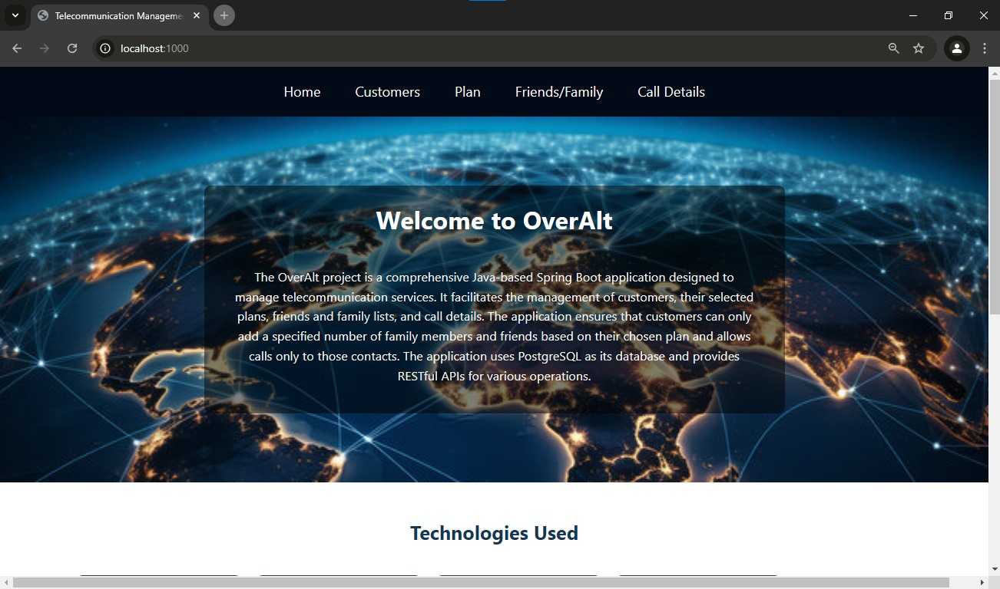

### Customer Management UI

#### Create Customer
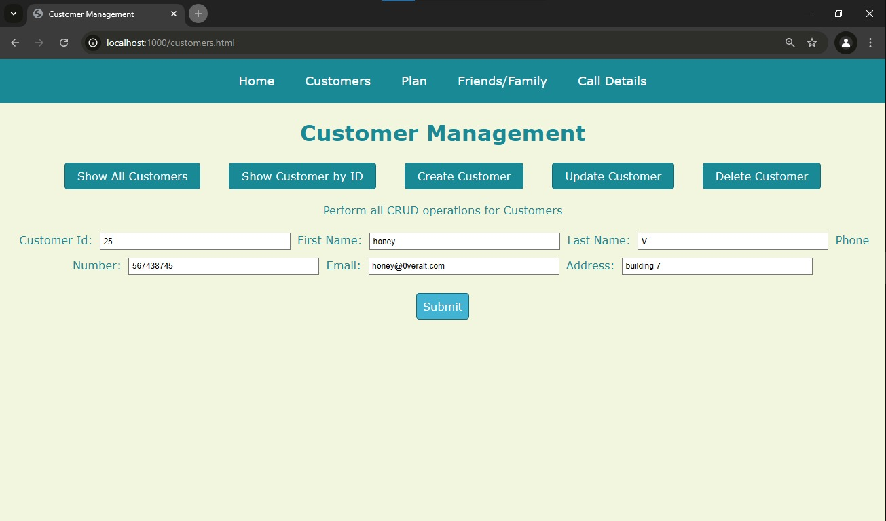

#### Get All Customers
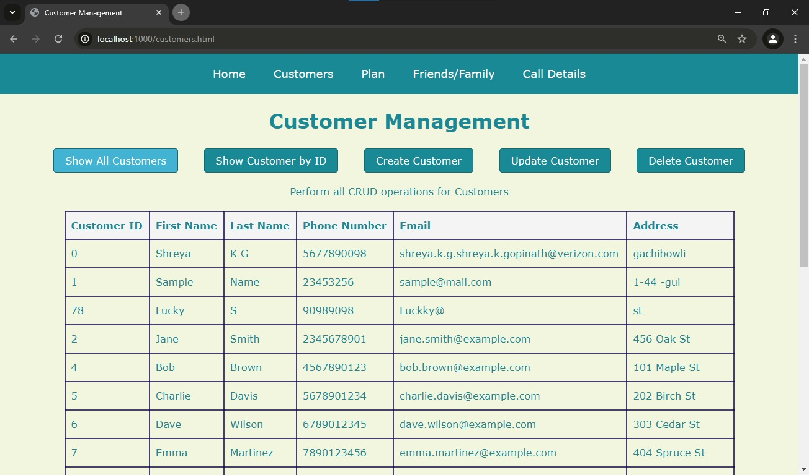

#### Get Customer By ID
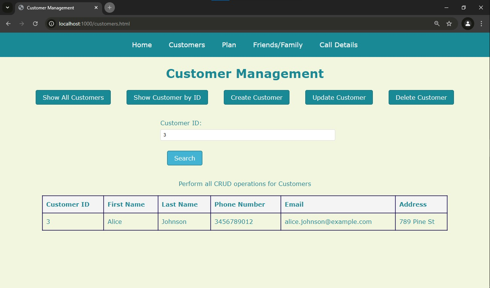

### Plan Management UI

#### Create Plan
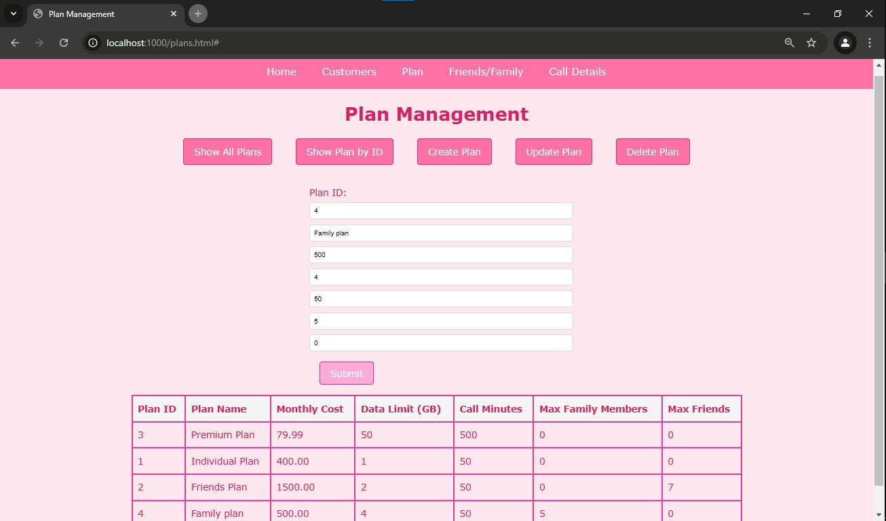

#### Delete Plan By ID
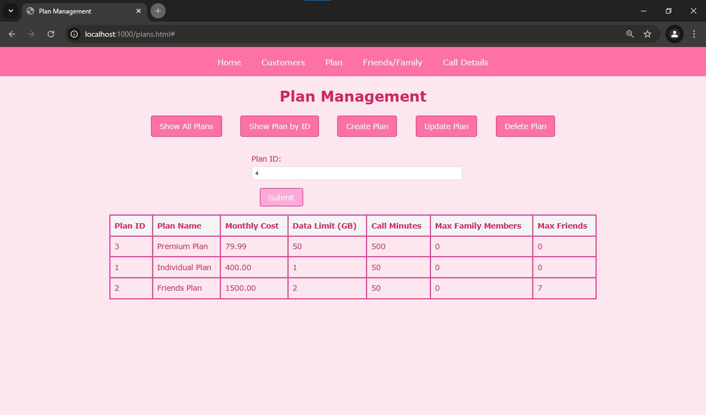

#### Get All Plans


#### Get Plan By ID
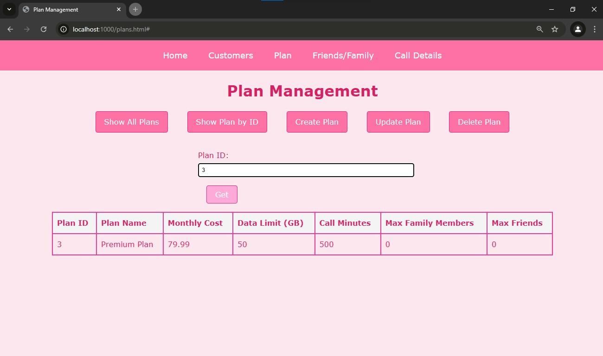

### Friends and Family Management UI

#### Create Friend or Family
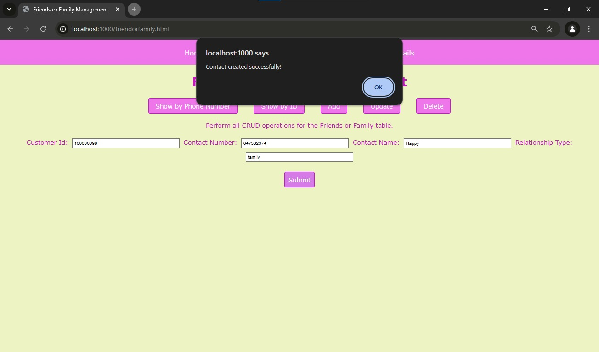

#### Get Friend or Family By ID
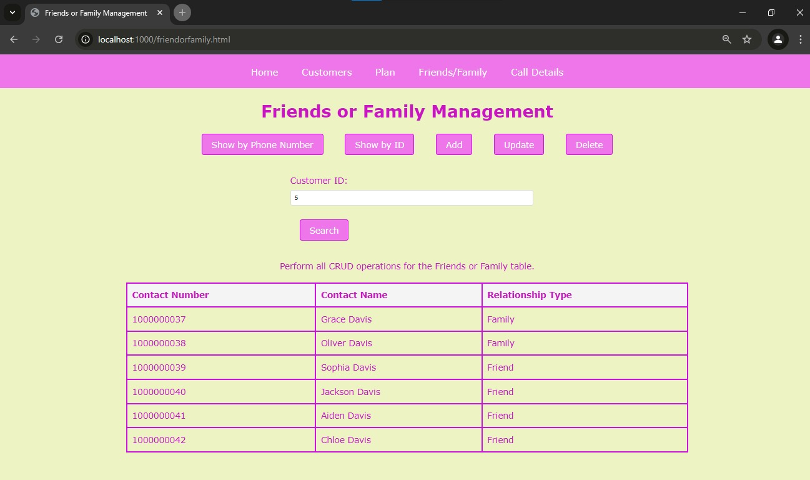

### Call Details Management UI

#### Find All Call Details
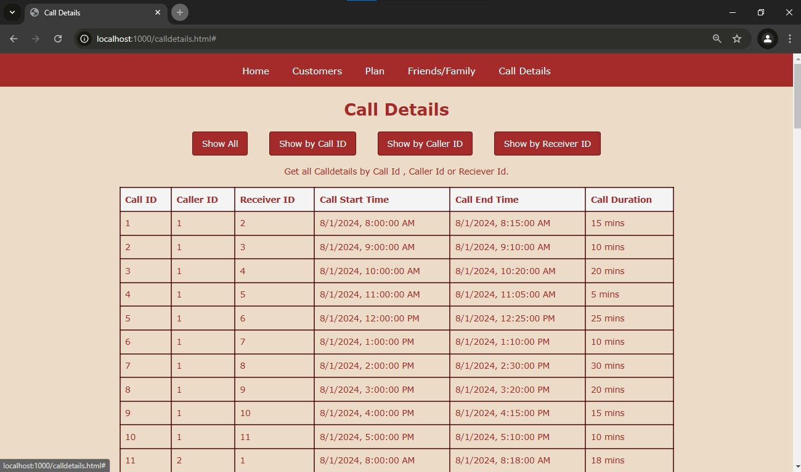

#### Get Call Detail By ID
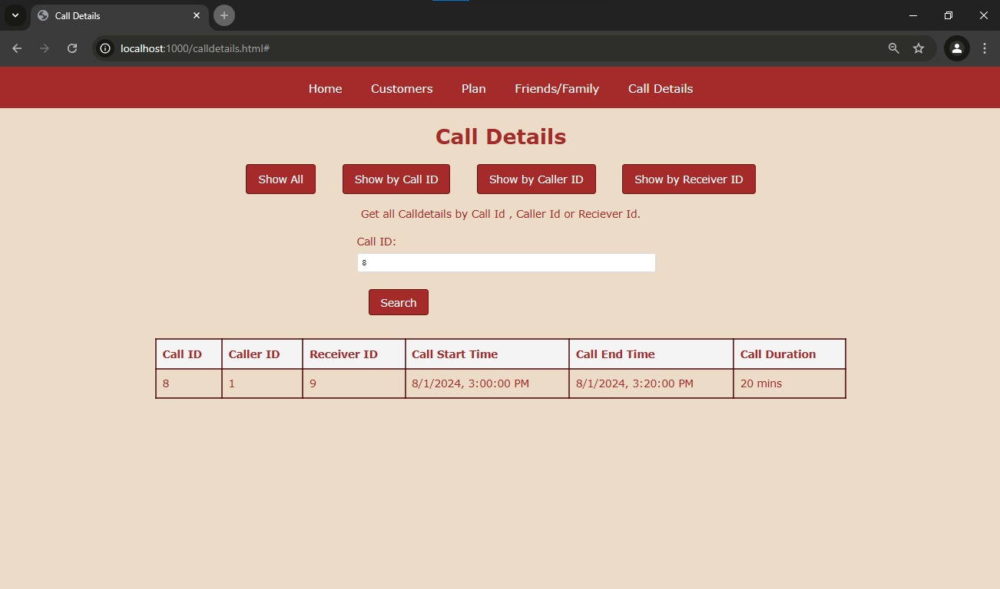

#### Get Call Details By Caller ID
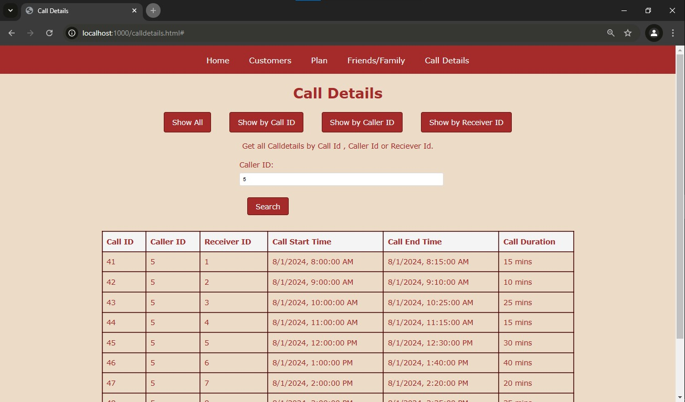

#### Get Call Details By Receiver ID
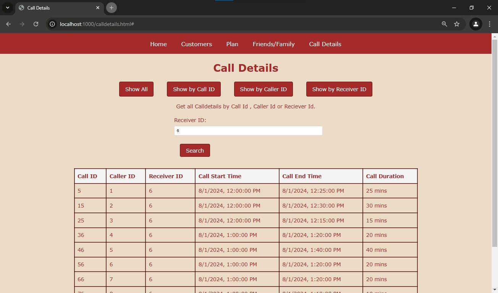

## Directory Structure

The project follows a standard Spring Boot directory structure:

```
src
├── main
│   ├── java
│   │   └── com
│   │       └── overalt
│   │           ├── controller
│   │           ├── model
│   │           ├── repository
│   │           ├── service
│   │           └── OverAltApplication.java
│   └── resources
│       └── static
│           ├── css
│           ├── images
│           ├── js
│           ├── calldetails.html
│           ├── customers.html
│           ├── friendorfamily.html
│           ├── header.html
│           ├── index.html
│           └── plans.html
└── test
    └── java
        └── com
            └── overalt
                ├── controller
                ├── service
                └── OverAltApplicationTests.java
```

## Troubleshooting

- **Database Connection Issues**: Ensure that PostgreSQL is running and the connection details in `application.properties` are correct.
- **Dependency Conflicts**: Run `mvn dependency:tree` or `./gradlew dependencies` to check for conflicts.

## Contributing

Contributions are welcome! Please submit a pull request or open an issue to discuss your ideas.

## License

This project is licensed under the Apache License 2.0 - see the [LICENSE](LICENSE) file for details.
